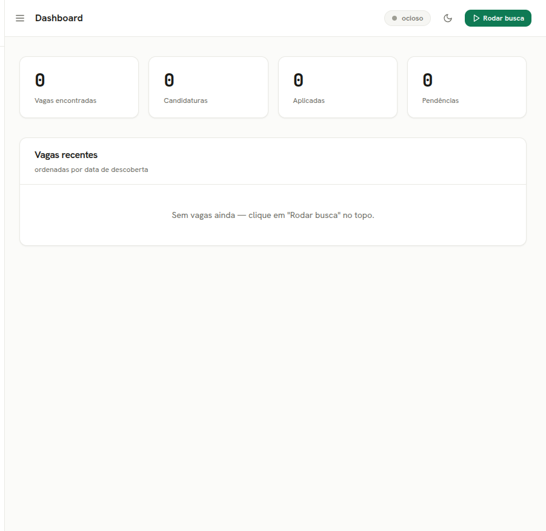
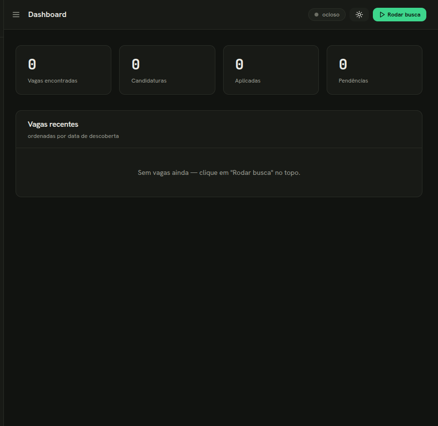
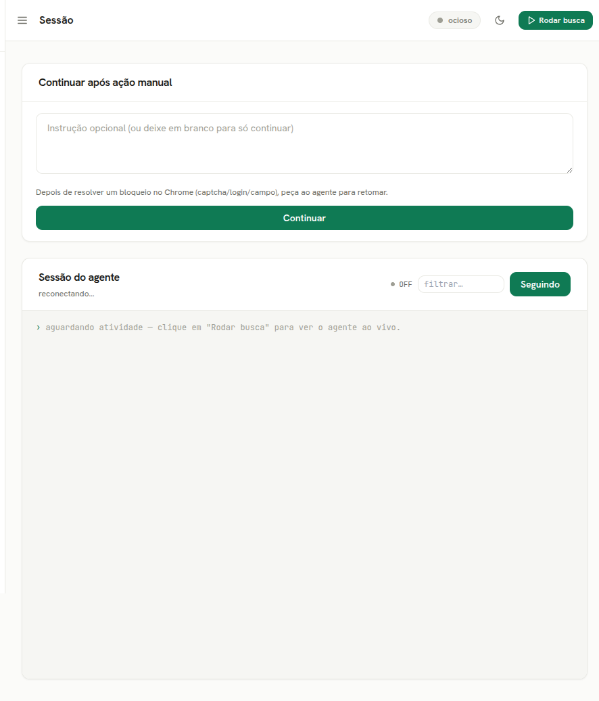
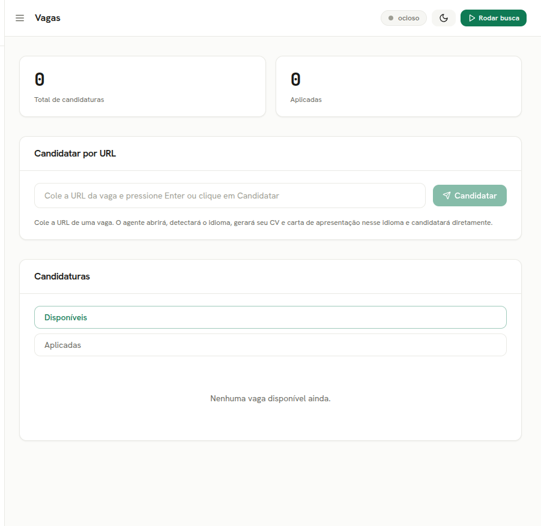

<div align="center">

# jobRabbit 🐇

**Auto-candidatura a vagas direto do terminal — movida pelo Claude Code + seu Chrome real.**

[English](README.md) · **Português 🇧🇷**

[](https://www.rust-lang.org/)
[](https://react.dev/)
[](https://www.typescriptlang.org/)
[](https://vitejs.dev/)
[](https://www.sqlite.org/)
[](https://www.docker.com/)
[](https://www.kernel.org/)
[](https://claude.com/claude-code)

[](https://github.com/renanmpimentel/jobrabbit/actions/workflows/ci.yml)
[](LICENSE)
[](#-validação)
[](#-idiomas--i18n)
[](#-contribuindo)
[](https://claude.com/claude-code)

</div>

---

O jobRabbit orquestra o **Claude Code CLI** (`claude`) que, através da extensão **Claude in
Chrome**, navega em sites de vaga no seu Chrome já logado, avalia o *fit* de cada vaga
contra o seu perfil, gera um CV / carta customizados e tenta se candidatar — pedindo a sua
ajuda (via **alerta no app** e notificação no desktop) quando esbarra em captcha, login ou um
campo que não sabe preencher sozinho.

Ele entrega **dois front-ends a partir de um único binário Rust**: uma **UI web local**
caprichada (o padrão) e uma **interface de terminal** clássica (`--tui`). Inspirado no
[claudia-rh](https://github.com/JohnGabie/claudia-rh) (Windows + Tauri/React); o jobRabbit é
um binário Rust único, feito para Linux.

<div align="center">

 
 

</div>

## ✨ Funcionalidades

| | |
|---|---|
| 🧭 **Dois front-ends** | **UI web** local (padrão, abre no navegador) + **TUI** clássica (`--tui`) — mesmo motor, mesmo SQLite. |
| 🤖 **Agente em navegador real** | Faz spawn do `claude` num PTY, lê o `stream-json` e conduz o **Claude in Chrome** (seu navegador real e logado — sem headless, sem Playwright). |
| 📄 **Import de perfil** | Monte seu perfil a partir de um **currículo** (PDF / DOCX / TXT) ou da sua **URL do LinkedIn** — o agente extrai background, CV base e variantes de busca sugeridas. |
| 🎯 **Avaliação de fit** | Cada vaga recebe nota 0.0–1.0 contra o seu perfil (senioridade, stack, modelo de trabalho, requisitos). |
| 🧩 **Playbooks por ATS** | Receitas por plataforma (Gupy, LinkedIn, Greenhouse, Lever, Workday, genérico) para o agente saber navegar em cada site. |
| 🗂️ **Banco de respostas** | Respostas de triagem reutilizáveis (pretensão salarial, aviso prévio, modelo de trabalho, …) que o agente usa para preencher formulários; aprende novas no caminho. |
| 🌐 **Fontes de vaga** | Escolha em quais sites o agente busca — 12 plataformas conhecidas já incluídas (LinkedIn, Gupy, Greenhouse, Lever, Workday, Indeed, …), e adicione as suas — no Config. |
| ⚖️ **Modos de candidatura** | `review` (prepara → você aprova), `autonomous` (auto-candidata com fit alto), `hybrid` (auto acima de um limiar). Mais um **dry-run** global e uma trava mestra de **revisão humana** (ligada por padrão) que sempre para para sua aprovação antes de preencher ou enviar — mesmo em autonomous/hybrid. |
| 🔔 **Alertas de pendência ao vivo** | Quando o agente trava (login, captcha, uma pergunta de triagem) você recebe um **toast no app**, um **banner** na tela de Execução e um **contador** na aba Pendências — além da notificação no desktop. |
| 📎 **Upload confiável** | O currículo é enviado como **PDF renderizado do seu CV**, então uploads nunca falham porque o site não aceita `.docx`. |
| 📊 **Avaliador de currículo (ATS)** | Dá nota 0–100 ao seu CV com um relatório acionável e uma **análise de keywords** (presentes vs. faltando, por importância) que você aplica a um CV melhorado em um clique. |
| 🌍 **Bilíngue** | **Inglês por padrão**, **pt-BR** selecionável — idioma da UI *e* do agente. Veja [Idiomas & i18n](#-idiomas--i18n). |

## 🏗️ Arquitetura

- **Front-ends** — uma **UI web** local (React + Vite + Tailwind, servida por um backend Axum) e uma **TUI** (ratatui/crossterm). Ambas compõem o mesmo core.
- **Agente** — o app faz spawn do `claude` num PTY e lê o `--output-format stream-json`. O agente emite um **protocolo NDJSON** (`job` / `application` / `pending` / `answer` / `feedback` / `profile` / `cv_review`) que o app persiste em SQLite. O agente só emite eventos; o DB pertence ao loop da UI.
- **Integrações Linux** — idle (`user-idle`), notificações (`notify-rust` / D-Bus), keyring (`keyring` v3 / Secret Service).

## 📋 Pré-requisitos (host / desktop)

- **Docker** — para build (o host não precisa de Rust nem Node).
- Para **rodar de verdade**: o `claude` CLI autenticado, **Google Chrome** + a extensão **Claude in Chrome**, e as libs `libxcb1 libxss1 libdbus-1-3`.

```bash
sudo apt install libxcb1 libxss1 libdbus-1-3
```

## 🚀 Início rápido

```bash
make            # padrão: testa → builda o bundle web + binário release → abre a UI web
```

…ou passo a passo:

```bash
make web-install   # instala as deps do front-end (web-ui/)
make test          # roda a suíte de testes Rust
make release       # gera ./dist/jobrabbit para o seu HOST
./dist/jobrabbit   # rode no seu desktop (onde estão o claude + Chrome)
```

Por padrão o `./dist/jobrabbit` abre a **UI web** no navegador. Prefere a interface de
terminal clássica? Rode `./dist/jobrabbit --tui`.

## 🛠️ Build & dev (via Docker)

```bash
make build        # compila (debug)
make test         # roda os testes
make snapshot     # renderiza as telas da TUI como texto (sem TTY)
make run          # UI web (precisa de claude + Chrome no host)
make tui          # TUI clássica (precisa de TTY)
make web-dev      # Vite dev server (HMR) em :5173, proxy /api → backend
make release      # builda ./dist/jobrabbit para o HOST
make fmt          # formata o código
make shell        # abre um shell no container de dev
```

## 📥 Importar perfil (CV ou LinkedIn)

Em vez de digitar o perfil na mão, importe de um **currículo** (PDF/DOCX/TXT) ou da sua
**URL do LinkedIn** — o `claude` estrutura em background + CV base + variantes de busca
sugeridas.

Na **UI web**: página **Perfil** → *Importar perfil*. Na **TUI**: aba Perfil (`2`) → `m`
(arquivo de CV) ou `l` (URL do LinkedIn).

Ou via CLI (headless):

```bash
./dist/jobrabbit --import-cv ~/curriculo.pdf
./dist/jobrabbit --import-linkedin https://www.linkedin.com/in/seu-perfil
```

> O background + CV importados **substituem** o perfil atual; as variantes sugeridas são
> **adicionadas** (sem duplicar). O import do LinkedIn navega via Chrome (logado).

## 🌍 Idiomas & i18n

O jobRabbit é **inglês primeiro** e totalmente internacionalizado:

- **UI web** — troque o idioma na página **Config** (English · Português). A escolha é
  persistida e também atualiza o idioma do **agente**, então ele busca e escreve no mesmo
  idioma.
- **TUI** — a aba **Config** tem a configuração **Language** (alterne com `espaço`).
- **Agente** — os prompts e os playbooks de ATS são sensíveis ao idioma. Com pt-BR, o agente
  busca em sites brasileiros e escreve CVs/cartas em português (o comportamento original);
  com inglês, opera em inglês.

As traduções ficam em `web-ui/src/locales/{en,pt-BR}.json` e em `src/locale.rs` +
`src/playbooks/{en,pt-br}/`. Novos idiomas são bem-vindos — veja [Contribuindo](#-contribuindo).

## ✅ Validação

```bash
make test                              # 115 testes (parser, DB, protocolo, prompts, sanitize, TUI)
./dist/jobrabbit --selftest-agent      # E2E real: roda o claude (prompt seguro, sem
                                       # browsing) por todo o pipeline e confere o SQLite
./dist/jobrabbit --snapshot            # preview das telas como texto (sem TTY)
./dist/jobrabbit --doctor              # diagnóstico do ambiente (deps + config)
```

## 🧰 Solução de problemas

- **"`claude` não encontrado"** — instale o Claude Code e autentique (`claude`). O jobRabbit avisa no startup e ao tentar rodar o agente.
- **Binário não inicia no host** — instale as libs: `sudo apt install libxcb1 libxss1 libdbus-1-3`.
- **TUI sem cores / quebrada** — use um terminal moderno (256 cores / UTF-8).
- **Notificações / idle não funcionam** — precisam de D-Bus e sessão gráfica (X11/Wayland). São best-effort; o resto do app funciona sem eles.
- **Dados / logs** — ficam em `~/.local/share/jobrabbit/` (`jobrabbit.db`, `settings.json`, `jobrabbit.log`). Playbooks customizados: `~/.local/share/jobrabbit/playbooks/<locale>/<slug>.md`.

## ⚠️ Uso responsável

Automatizar candidaturas pode conflitar com os Termos de Serviço do site. **Verifique os ToS
de cada site de vaga** quanto à automação — o uso é de sua responsabilidade. O jobRabbit
mantém um humano no loop por padrão (modo `review`) e nunca burla captchas.

## 🤝 Contribuindo

PRs são bem-vindos! Boas primeiras contribuições: novos playbooks de ATS, idiomas adicionais
e polimento de UI. Mantenha a suíte de testes verde (`make test`) e o código somente em inglês.

## 📄 Licença

MIT — veja [LICENSE](LICENSE).

<div align="center">
<sub>Feito com 🐇 e <a href="https://claude.com/claude-code">Claude Code</a>.</sub>
</div>
